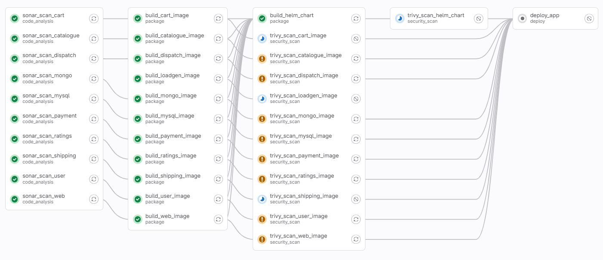
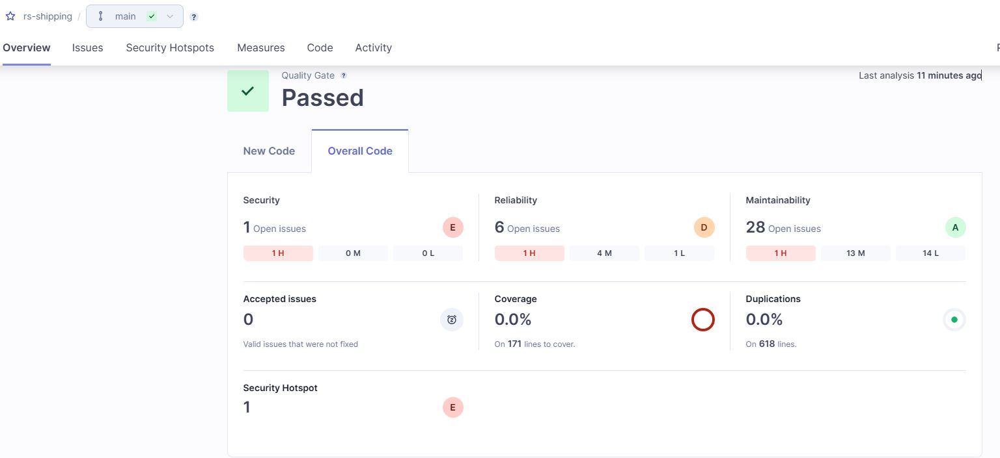
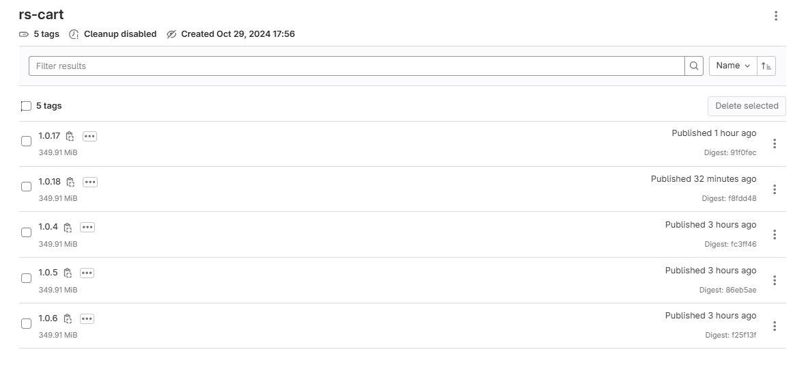
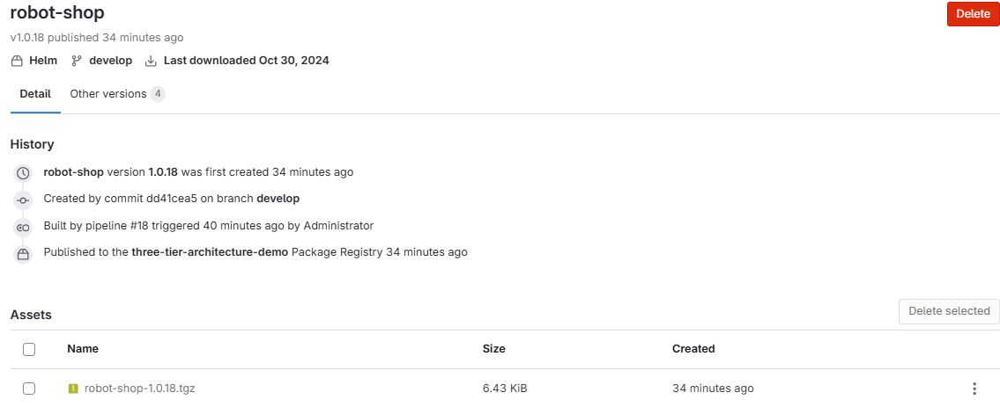

## Gitlab CI

### Overview

- pipeline defined in [.gitlab-ci.yml](.gitlab-ci.yml)
- jobs are executed within Kubernetes clusters - allows parallel execution and can scale (target GKE is configured to auto-scale)
- caching is utilized to speed up job execution

### Jobs

#### 1. Unit Test 
  - not implemented. base code don't have unit tests

#### 2. SonarQube Static Code Analysis
  - detects coding and security issues in the code
  - quality gate enabled to fail the job when code quality is lower than quality profile set.
  - sample log: [sonar-scan.log](docs/logs/sonar-scan.log)

#### 3. Container Image Build and Registry Push
  - utilized Kaniko to build image to avoid using privileged mode - which is more secured.
  - utilized built-in Gitlab Container Registry
  - sample log: [docker-build.log](docs/logs/docker-build.log)

#### 4. Kubernetes App Package
  - utilized Helm to package and manage versions
  - utilized built-in Gitlab Package Registry to store Helm Charts

  

#### 5. Image and Helm Chart Security Scan
  - utilized Trivy to scan images
  - sample log: [image-scan.log](docs/logs/image-scan.log)

#### 6. Pre-deployment Tests
  - not implemented. would be nice if have these tests:
    - Integration Test
    - UI Test
    - Load Test
    - Security Penetration Test

#### 7. Deploy
  - utilized built-in Gitlab connectivity to Kubernetes cluster.
  - sample log: [deploy.log](docs/logs/deploy.log)
  